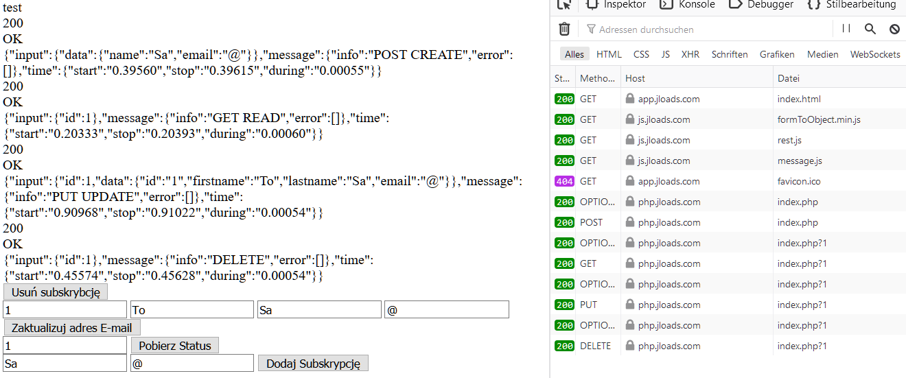
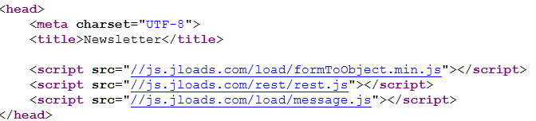
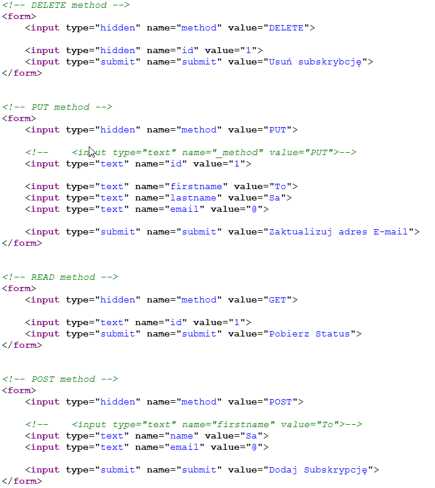
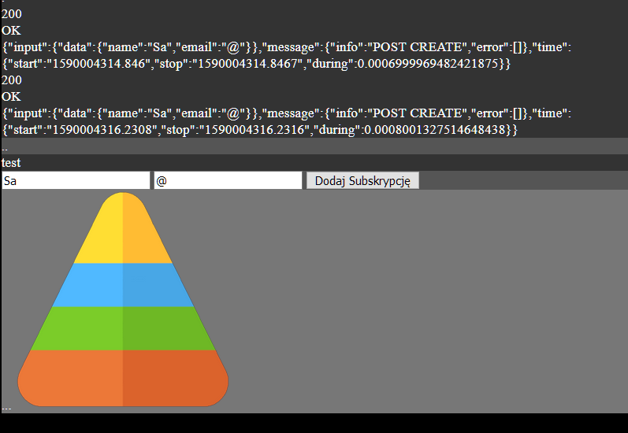

# Form based on js.jloads.com - oldest version from 2020
It's just an example...

Frontend app, 
using js.jloads.com, small html modules, possible to use in external projects

[app.jloads.com/visitor/newsletter/page/index.html](https://app.jloads.com/visitor/newsletter/page/index.html)

## How it works?

## localhost url's

[Home app.jloads.com](http://localhost:3000/visitor/home/page/index.html?method=POST&name=Sa&email=%40&submit=Dodaj+Subskrypcj%C4%99)

[Auth](http://localhost:3000/visitor/auth/page/index.html)

[File](http://localhost:3000/visitor/file/page/index.html)

[Home](http://localhost:3000/visitor/home/page/index.html)

[Newsletter](http://localhost:3000/visitor/newsletter/page/index.html)
